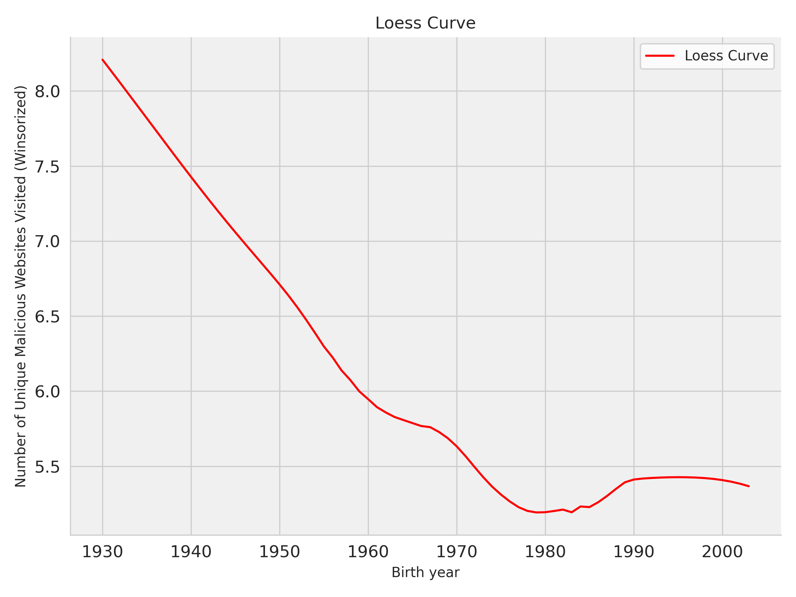

### Bad Domains: Exposure to Malicious Content Online

Traditional concerns about the digital divide have been exacerbated by concerns about safety. In this paper, using passively observed domain-level browsing data for a **month** on 1200 Americans from YouGov and data on malicious domains from [Virustotal](https://www.virustotal.com/), we test if the poor, the less educated, the older, or the minorities are more likely to visit malicious websites than their counterparts. 

We find that visits to malicious websites--websites that carry exploits or other malicious artifacts--are highly skewed. The median user visited 4 different websites with malicious content over the month, the 75th percentile visited 9, the 95th percentile 16, and the 99th percentile 48. In all, more than 84\% of people visited at least one website with malicious content/activity over the month.

**Distribution of Number of Unique Websites With Malicious Content Visted, Number of Visits, Time Spent, And Number of Suspicious Websites Visited**

|       |   malicious_unique |   malicious_visits |   malicious_time |   suspicious_bool |
|:------|-----------------:|-------------------:|-----------------:|------------------:|
| count |             1134 |               1134 |             1134 |              1134 |
| mean  |                7 |                190 |              171 |                 2 |
| std   |               13 |                704 |             1858 |                 4 |
| min   |                0 |                  0 |                0 |                 0 |
| 15%   |                0 |                  0 |                0 |                 0 |
| 16%   |                1 |                  1 |                0 |                 0 |
| 25%   |                1 |                  4 |                0 |                 0 |
| 26%   |                1 |                  5 |                0 |                 0 |
| 50%   |                4 |                 29 |               11 |                 2 |
| 75%   |                9 |                121 |               47 |                 4 |
| 95%   |               27 |                783 |              339 |                10 |
| 99%   |               48 |               2229 |             1876 |                17 |
| max   |              252 |              15136 |            51376 |                58 |

Visits to malicious sites are not explained well by race. The median is 4 for all races and ethnicities except for 'Other', for whom it is 4.5. There are, however, meaningful differences at the 75th percentile. The 75th percentile is lowest for Hispanics at 7 and highest for African Americans at 10. The time spent on malicious websites has more variegation. The median time spent by African Americans on malicious websites is 15.5 minutes, 11 minutes for Whites, 10.5 minutes for Hispanics, and 8.5 minutes for Asians.

**Distribution of Number of Unique Websites With Malicious Content Visited by Race**

| race_lab   |   count |   mean |   std |   min |   25 |   50 |   75 |   max |
|:-----------|--------:|-------:|------:|------:|-----:|-----:|-----:|------:|
| White      |     720 |    7.6 |  11.1 |     0 |    1 |  4   |  9   |   133 |
| Black      |     144 |   10.7 |  25.9 |     0 |    1 |  4   | 10   |   252 |
| Hispanic   |     168 |    6.8 |   9.5 |     0 |    1 |  4   |  7   |    48 |
| Asian      |      46 |    6.9 |   9.2 |     0 |    1 |  4   |  8.8 |    43 |
| Other      |      56 |    6.7 |   8.3 |     0 |    1 |  4.5 |  8   |    39 |

Visits across the sexes show small but systematic differences with men visiting more malicious websites than women. Men also spend more time on websites with malicious content than women. The median number of visits for women is 4, while for men it is 5. Women spend 10 minutes vs. men's 14 minutes.

**Distribution of Number of Unique Websites With Malicious Content Visited by Gender**

| gender_lab   |   count |   mean |   std |   min |   25 |   50 |   75 |   max |
|:-------------|--------:|-------:|------:|------:|-----:|-----:|-----:|------:|
| Female       |     595 |    6.9 |  11.4 |     0 |    1 |    4 |    8 |   136 |
| Male         |     539 |    8.8 |  15.6 |     0 |    1 |    5 |   11 |   252 |

Education matters but the only discernible difference is between people with a postgraduate degree or more and those with less education than that. The median number of different websites with malicious content that people with a postgraduate degree visited was 3 instead of 4 for people with less education than that. We see a similar pattern for time spent on malicious websites with the median time spent by people with a postgraduate education or more being 7 minutes and 12 or 13 minutes for people with less education than that.

**Distribution of Number of Unique Websites With Malicious Content Visited by Education**

|    | educ_lab     |   count |   mean |   std |   min |   25 |   50 |   75 |   max |
|---:|:-------------|--------:|-------:|------:|------:|-----:|-----:|-----:|------:|
|  1 | HS or Below  |     411 |    8.1 |  13.9 |     0 |    1 |    4 |  9   |   136 |
|  3 | Some college |     326 |    8.2 |  17   |     0 |    1 |    4 |  9   |   252 |
|  0 | College      |     255 |    7.5 |   9.8 |     0 |    1 |    4 | 10   |    64 |
|  2 | Postgrad     |     142 |    6.3 |   8.9 |     0 |    1 |    3 |  7.8 |    62 |'

Lastly, when we look at age, there is a steady increase in the number of unique websites with malicious content visited as people grow older after a plateau between ages of 20 and 40. The trend for [time spent on websites (winsorized)](figs/age_time_malicious_winsorized.png) (or [raw](figs/age_time_malicious.png)) looks broadly similar.

#### Data

* [Data](data/)
* Raw browsing data is on [Harvard Dataverse](https://dataverse.harvard.edu/dataset.xhtml?persistentId=doi:10.7910/DVN/VIV4TS) 

### Scripts

* [Process Vote Reg. Data](scripts/01_fl_dat.ipynb)
* [Emails Valid or Not (w/ DNS)](scripts/01a_valid_email_or_not.ipynb)
* [Get HIBP Data](scripts/02_get_fl_hibp.ipynb)
* [Analyze](scripts/03_concat_fl_dat_analyze.ipynb)

#### Authors

Lucas Shen and Gaurav Sood
